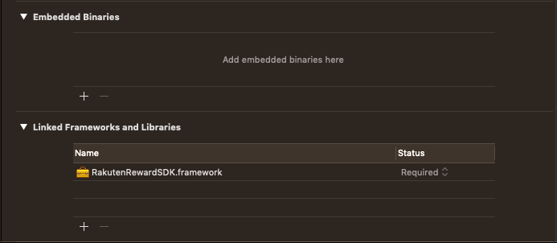
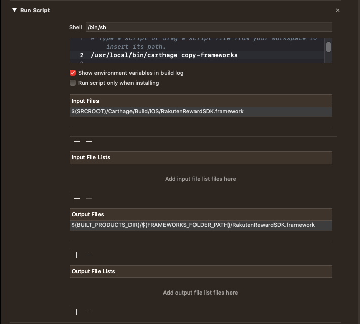

# Rakuten Reward SDK for iOS

Public releases for Rakuten Reward SDK, iOS version, including CocoaPods and Carthage specs.

## Integration with Xcode projects

Swift frameworks are not necessarily binary compatible across different Xcode versions. Please pay attention to the Xcode version that was used to compile the SDK for iOS.

### via Carthage

Add `Cartfile` to root folder of your Xcode project. In the file, please input the below:

```
binary "https://raw.githubusercontent.com/Rakuten-Reward-SDK/Reward-SDK-iOS/master/CarthageSpec.json"
```

Run `carthage update` to download the latest version of SDK to `<YOUR_PROJECT_FOLDER>/Carthage/iOS`. Drag `RakutenRewardSDK.framework` from this folder to `Linked Frameworks and Libraries` (**DO NOT** drag it to `Embedded Binaries`, it will conflict with `copy-frameworks` script of Carthage).



**NO NEED** enabling `Always embed Swift Standard Libraries` in project `Build Settings` if you're on Swift project.

Finally, use built-in script of Carthage to remove fat binary framework issue for App Store submission (for v9.1.0 and below) 

open `Build Phases` of Xcode project and add `New Run Script Phase`, add a setup as in the image below:
- shell script: `/usr/local/bin/carthage copy-frameworks`
- Input files: `$(SRCROOT)/Carthage/Build/iOS/RakutenRewardSDK.framework`
- Output files: `$(BUILD_PRODUCT_DIR)/$(FRAMEWORK_FOLDER_PATH)/RakutenRewardSDK.framework`  



### via CocoaPods

Adding Reward SDK via CocoaPods require custom `source`, please add to your `Podfile` the spec as below

```ruby
source 'https://github.com/CocoaPods/Specs.git'
source 'https://github.com/Rakuten-Reward-SDK/Reward-SDK-iOS.git'
 
target '<YOUR_TARGET_NAME>' do
  use_frameworks!
pod 'RakutenRewardSDK'
end
```

Run `pod install` from command line, and you're good to go, there's no step 3.

For more technical details on CocoaPods, please visit its [documentation](https://guides.cocoapods.org/using/using-cocoapods).

**Warning**: CocoaPods might face some [issues with Xcode 10.2](https://github.com/CocoaPods/CocoaPods/issues/8458), please update to latest CocoaPods version

### via Swift Package Manager (SPM)

Add the dependency value below

```
dependencies: [
    .package(url: "https://github.com/Rakuten-Reward-SDK/Reward-SDK-iOS-SPM.git", .exact("10.1.0")),
]
```

<br>
This product includes software developed by the "Marcin Krzyzanowski" (http://krzyzanowskim.com/).

## Licensing

Rakuten Reward SDK is under commercial license. Copyright © Rakuten Asia Pte. Ltd. All Rights Reserved. Use of this software is subject to the terms and conditions, please register at [Rakuten Reward Developer Portal](https://developer.reward.gl.rakuten.co.jp/main) for access.
